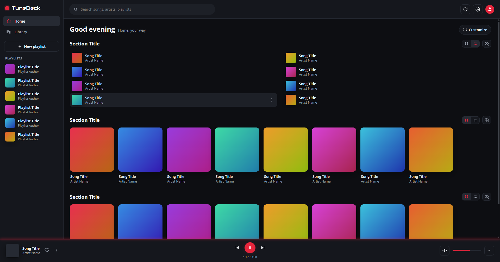
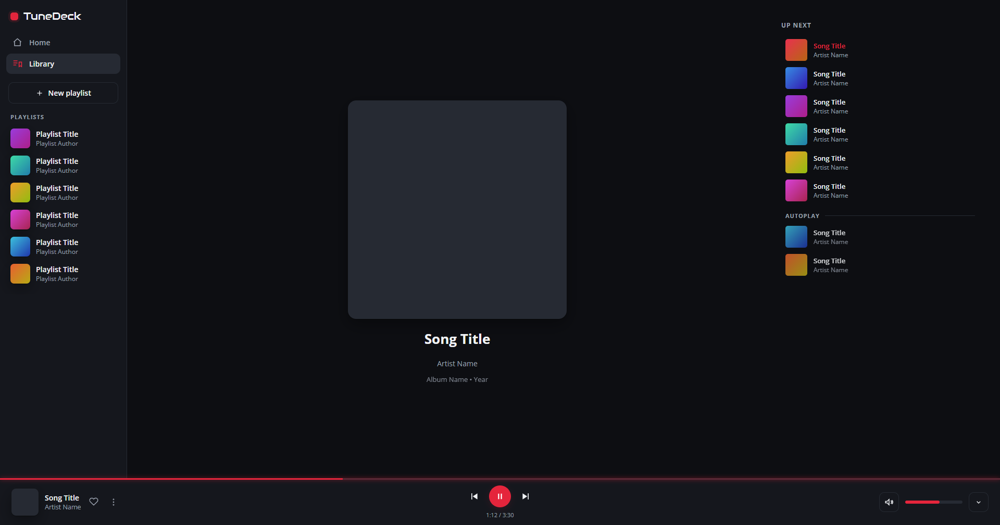
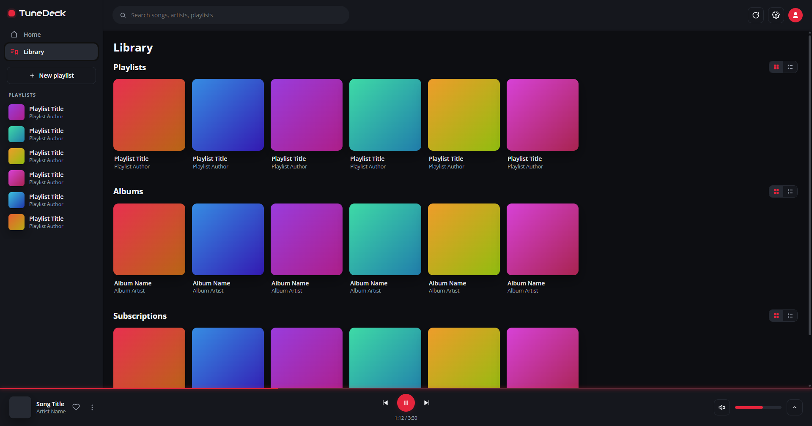
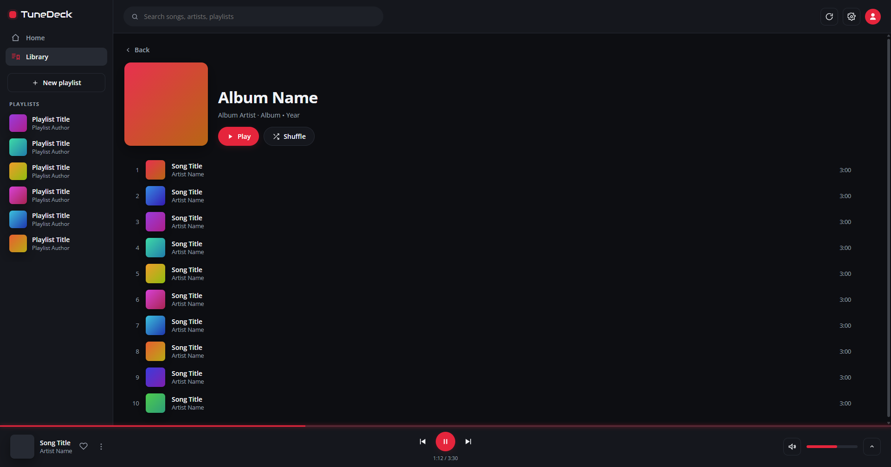
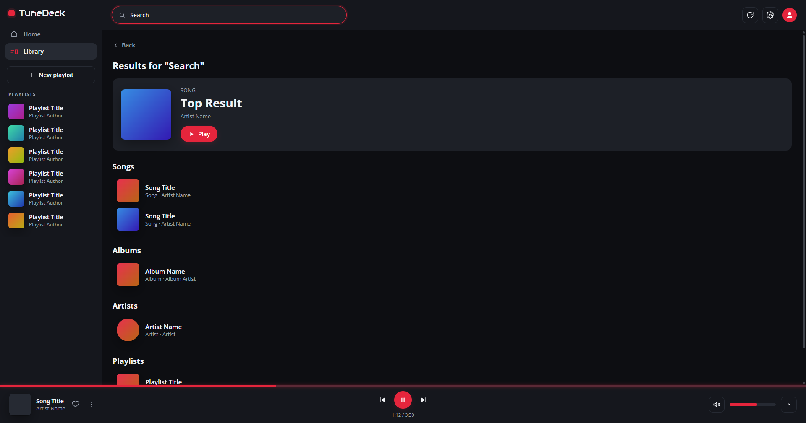
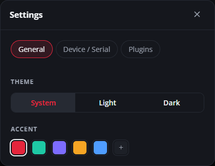
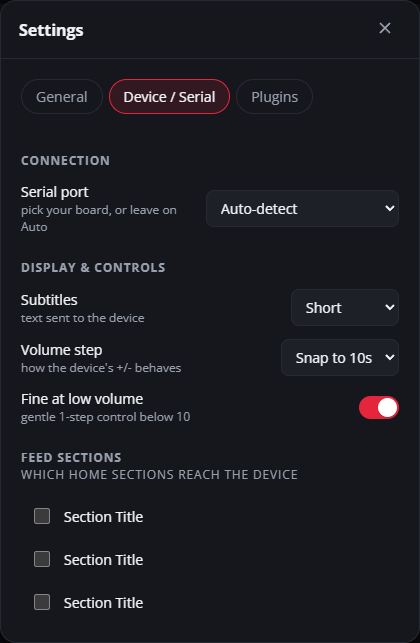

# TuneDeck

[](LICENSE)
[](https://tauri.app)
[](https://discord.gg/zkfgzTra4w)

TuneDeck is a desktop client for YouTube Music that draws its own interface
instead of wrapping the website. It's also the companion app for
[TuneFrame](https://github.com/loonek/TuneFrame): plug the touchscreen in over USB
and TuneDeck drives it directly, with no browser extension or bridge in between.

<p align="center">
  
</p>

## How it works

YouTube Music has no desktop app and no open API, and the audio is DRM-protected,
so there's nothing you can just query and play songs from. TuneDeck runs
`music.youtube.com` in a hidden WebView2 window - that window logs you in, holds
the audio session and answers data queries, and you never actually see it. An
injected reader pulls state out of it and hands it to the Rust core, which sends
control back by running JS in the same hidden page. What you look at is TuneDeck's
own HTML, CSS and JS.

It's more work than just loading the site in a window, but it means the interface
is mine, and there's somewhere to put the things YTM won't do itself: a hardware
display, Discord presence, plugins.

## What's in it

- Now playing, as a full view and a bottom mini-player: title, artist, cover,
  progress, volume, transport, like
- A home feed whose sections you can hide, reorder, and flip between big cards and
  a compact list
- Search, plus album and artist pages
- A queue you can scroll and tap to jump around; drop a track at the top to play it
  next, at the bottom to add it to the end
- Playlists you can actually edit: add, remove, reorder, save-to, create, delete
- A library split into playlists, albums and subscriptions

The theme follows the OS, light or dark, with an accent you can set.

## Screens

These are from a demo build, so the covers are placeholders and everything reads
"Song Title" / "Artist Name" - the layout is the real thing.

<p align="center">
  
  
</p>

<details>
<summary>More screens</summary>

<p align="center">
  
  
</p>

<p align="center">
  
</p>

<p align="center">
  
  
</p>

</details>

## Plugins

TuneDeck can be extended two ways, both configured under **Settings -> Plugins**
(the controls there are generated from each plugin's manifest).

Some plugins are compiled in, written in Rust, for things a web page simply can't
do - right now that's Discord Rich Presence and the TuneFrame serial link. The rest
are drop-in JS: you put a folder with a `manifest.json` and an `index.js` in the
app's `plugins/` dir and it shows up. Those are good for engine tweaks, reacting to
the current track, or talking to an HTTP service (a scrobbler, a webhook).

Writing one is covered in [`docs/PLUGINS.md`](docs/PLUGINS.md), and there's a small
example in [`plugins-examples/now-playing-logger/`](plugins-examples/now-playing-logger).
JS plugins run in TuneDeck's own context for now, with no sandbox, so only install
code you trust - that's on the list to fix.

## TuneFrame

If you have a [TuneFrame](https://github.com/loonek/TuneFrame) board, TuneDeck
replaces its extension and bridge entirely. Turn on the serial plugin, pick the
board's port under **Settings -> Device**, and it starts streaming the now-playing
state, your feed and playlists, the queue, and the cover art and thumbnails (as raw
RGB565), and reading taps back. The subtitle format, the volume step, and which
feed sections reach the board are all adjustable.

The link speaks TDSP, a small JSON-lines protocol that isn't tied to TuneFrame -
any UART or USB-CDC device can implement just the frames it wants and ignore the
rest. It's written up in [`docs/PROTOCOL.md`](docs/PROTOCOL.md).

## Building it

You'll want [Rust](https://rustup.rs), the
[Tauri 2 system deps](https://tauri.app/start/prerequisites/), Node for the Tauri
CLI, and on Windows the WebView2 runtime (which ships with Windows 11).

```bash
npm install
npm run tauri dev     # run it
npm run tauri build   # bundle an installer
```

The front end is plain HTML/CSS/JS with no framework or build step, in
[`src/`](src); the Rust side is in [`src-tauri/`](src-tauri).

## Poking around the code

The UI is in [`src/`](src) - `index.html`, `styles.css`, and `main.js` (the views,
the plugin runtime, the settings). The Rust core is
[`src-tauri/src/lib.rs`](src-tauri/src/lib.rs): the commands, the setup that builds
the hidden engine window, and the event relay between it and the UI. The reader
that gets injected into the hidden YTM page is
[`src-tauri/reader/main_world.js`](src-tauri/reader/main_world.js) - it's where the
`window.__tunedeck*` helpers and all the events come from. Serial is in
[`src-tauri/src/serial.rs`](src-tauri/src/serial.rs), and the plugin framework in
[`src-tauri/src/plugins/`](src-tauri/src/plugins).

Read [`DESIGN.md`](DESIGN.md) before anything else - it explains the architecture,
and it has a "Dead ends" section listing the things that turned out to be
impossible (an owned queue, arbitrary queue reorder, Downloads) and why, so nobody
spends days walking into the same walls.

## Questions and bugs

There's a Discord for TuneFrame and TuneDeck, usually easier than GitHub issues:
**https://discord.gg/zkfgzTra4w**

And it's not just for bugs - if something about the way TuneDeck works feels clumsy
or awkward to you, I'd like to hear it. Suggestions for the experience are welcome,
on Discord or as an issue.

## Privacy

TuneDeck reads your YouTube Music playback and library and keeps it local. It stays
in the app's own UI, goes to a TuneFrame on your own USB port, and - only if you
turn the Discord plugin on - to your running Discord client. Nothing goes to me or
any third party.

Signing in happens in the hidden YouTube Music engine, the same as signing in to the
site in a browser; that session is the only thing kept. TuneDeck itself stores
nothing about your account - no library, no email, no avatar - it reads everything
live. Logging out wipes the session.

## License

[GPL-3.0](LICENSE) - free to use, modify and share; anything you distribute has to
stay open under the same license.

## Disclaimer

TuneDeck is an independent, unofficial project. It is not affiliated with,
authorized by, endorsed by, or connected to Google LLC, YouTube, or YouTube Music.

"Google", "YouTube" and "YouTube Music", along with related names and logos, are
trademarks of their respective owners and are used here for identification only.

TuneDeck is provided "as is", without warranty of any kind; you use it at your own
risk (see the [GPL-3.0 license](LICENSE), sections 15 and 16).
</content>
